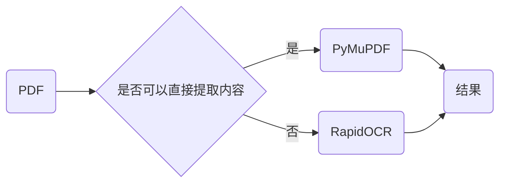

<div align="center">
    <div align="center">
    <h1><b><i>RapidOCR 📄 PDF</i></b></h1>
    </div>

<a href="">=3.6,<3.12-aff.svg"></a>
<a href=""></a>
<a href="https://pypi.org/project/rapidocr-pdf/"></a>
<a href="https://pepy.tech/project/rapidocr-pdf"></a>
<a href="https://semver.org/"></a>
<a href="https://github.com/psf/black"></a>
<a href="https://choosealicense.com/licenses/apache-2.0/"></a>

</div>

### 简介

本仓库依托于[RapidOCR](https://github.com/RapidAI/RapidOCR)仓库，快速提取PDF中文字，包括扫描版PDF、加密版PDF、可直接复制文字版PDF。

🔥🔥🔥 版式还原参见项目：[RapidLayoutRecover](https://github.com/RapidAI/RapidLayoutRecover)

### 整体流程



### 安装

```bash
# 基于CPU 依赖rapidocr_onnxruntime
pip install rapidocr_pdf[onnxruntime]

# 基于CPU 依赖rapidocr_openvino 更快
pip install rapidocr_pdf[openvino]

# 基于GPU 依赖rapidocr_paddle
# 1.安装 PaddlePaddle 框架 GPU 版, 参见: https://www.paddlepaddle.org.cn/
# 2.安装 rapidocr_pdf[paddle]
pip install rapidocr_pdf[paddle]
```

### 使用

脚本使用

```python
from rapidocr_pdf import PDFExtracter

pdf_extracter = PDFExtracter()

pdf_path = 'tests/test_files/direct_and_image.pdf'
texts = pdf_extracter(pdf_path, force_ocr=False)
print(texts)
```

命令行使用

```bash
$ rapidocr_pdf -h
usage: rapidocr_pdf [-h] [-path FILE_PATH] [-f]

optional arguments:
  -h, --help            show this help message and exit
  -path FILE_PATH, --file_path FILE_PATH
                        File path, PDF or images
  -f, --force_ocr       Whether to use ocr for all pages.

$ rapidocr_pdf -path tests/test_files/direct_and_image.pdf
```

### 输入输出说明

**输入**：`Union[str, Path, bytes]`

**输出**：`List` \[**页码**, **文本内容**, **置信度**\]， 具体参见下例：

```python
[
    ['0', '人之初，性本善。性相近，习相远。', '0.8969868'],
    ['1', 'Men at their birth, are naturally good.', '0.8969868'],
]
```

### [更新日志](https://github.com/RapidAI/RapidOCRPDF/releases)
