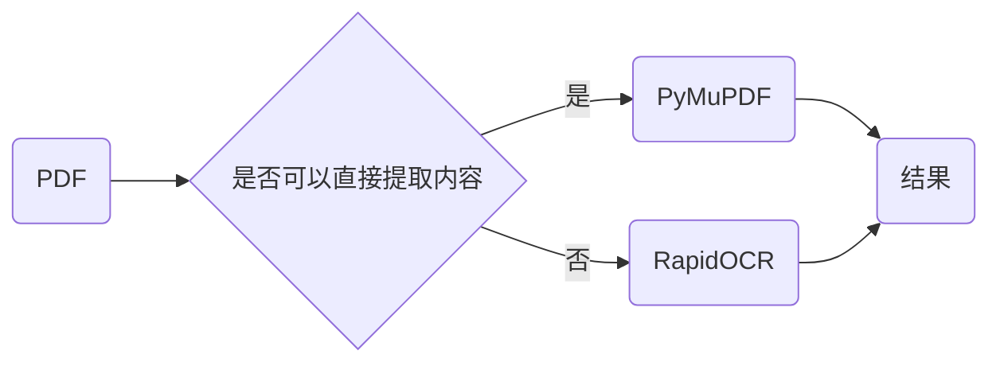

<div align="center">
    <div align="center">
    <h1><b><i>RapidOCR 📄 PDF</i></b></h1>
    </div>

<a href="https://huggingface.co/spaces/RapidAI/RapidOCRPDF" target="_blank"></a>
<a href="https://www.modelscope.cn/studios/RapidAI/RapidOCRPDF/summary" target="_blank"></a>
<a href="">=3.6-aff.svg"></a>
<a href=""></a>
<a href="https://pypi.org/project/rapidocr-pdf/"></a>
<a href="https://pepy.tech/project/rapidocr-pdf"></a>
<a href="https://semver.org/"></a>
<a href="https://github.com/psf/black"></a>
<a href="https://choosealicense.com/licenses/apache-2.0/"></a>

</div>

### 简介

本仓库依托于[RapidOCR](https://github.com/RapidAI/RapidOCR)仓库，快速提取PDF中文字，包括扫描版PDF、加密版PDF、可直接复制文字版PDF。

### 整体流程



### 安装

```bash
pip install rapidocr_pdf
```

### 使用

#### 脚本使用

⚠️注意：在`rapidocr_pdf>=0.4.0`中，支持`page_num_list`参数为负数，假设总页数为2，范围为`[-2, 1]`。

⚠️注意：在`rapidocr_pdf>=0.3.0`中，支持了`page_num_list`参数，默认为None，全部提取。**如果指定，页码从0开始**。

⚠️注意：在`rapidocr_pdf>=0.2.0`中，已经适配`rapidocr>=2.0.0`版本，可以通过参数来使用不同OCR推理引擎来提速。
下面的`ocr_params`为示例参数，详细请参见RapidOCR官方文档：[docs](https://rapidai.github.io/RapidOCRDocs/main/install_usage/rapidocr/usage/#_4) 。

```python
from rapidocr_pdf import RapidOCRPDF

pdf_extracter = RapidOCRPDF(ocr_params={"Global.with_torch": True})

pdf_path = "tests/test_files/direct_and_image.pdf"

# page_num_list=[1]: 仅提取第2页
texts = pdf_extracter(pdf_path, force_ocr=False, page_num_list=[1])
print(texts)
```

#### 命令行使用

```bash
$ rapidocr_pdf -h
usage: rapidocr_pdf [-h] [--dpi DPI] [-f] [--page_num_list [PAGE_NUM_LIST ...]] pdf_path

positional arguments:
  pdf_path

options:
  -h, --help            show this help message and exit
  --dpi DPI
  -f, --force_ocr       Whether to use ocr for all pages.
  --page_num_list [PAGE_NUM_LIST ...]
                        Which pages will be extracted. e.g. 0 1 2.

$ rapidocr_pdf tests/test_files/direct_and_image.pdf --page_num_list 0 1
```

### 输入输出说明

**输入**：`Union[str, Path, bytes]`

**输出**：`List` \[**页码**, **文本内容**, **置信度**\]， 具体参见下例：

```python
[
    [0, '人之初，性本善。性相近，习相远。', 0.8969868],
    [1, 'Men at their birth, are naturally good.', 0.8969868],
]
```
